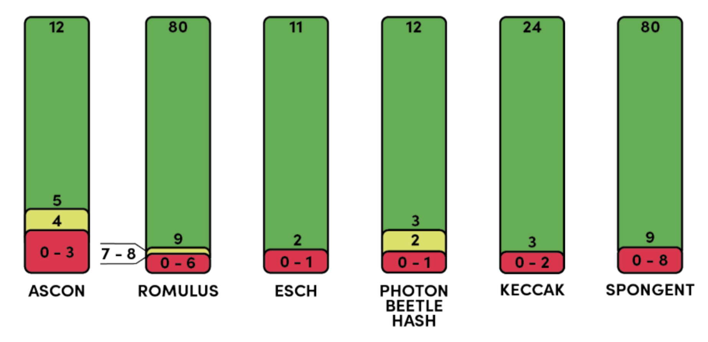

# Comparison of SAT-Solver Attacks with Brute-Force Attacks 

This project was developed as part of my Bachelor's degree program at the University of Technology Graz. The primary objective of this research was to conduct a comparative analysis between SAT-Solver attacks and Brute-Force attacks.

During the investigation, we extensively evaluated the performance of SAT-Solver attacks and observed fascinating results. Particularly, we noticed that the SAT-Solver excelled in scenarios involving a lower round amount, showcasing its efficiency and effectiveness in such settings.

- red $\rightarrow$ Vulnerable to SAT-Solver attacks (Solution was found in a couple of seconds)
- yellow $\rightarrow$ Vulnerable to SAT-Solver attacks (Solution was found in under 24 hours)
- green $\rightarrow$ Not Vulnerable to SAT-Solver attacks (Solutin was not found in under 24 hours)

For further readings, head to the [paper](https://docs.google.com/viewer?url=https://fileserver.p4s3r0.it/personal/documents/bac_thesis.pdf) of the research.
